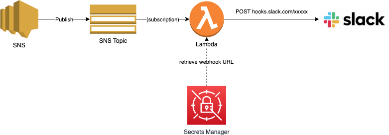
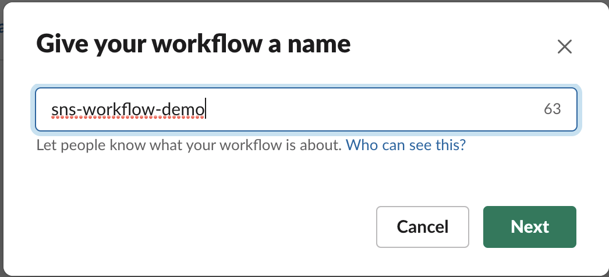
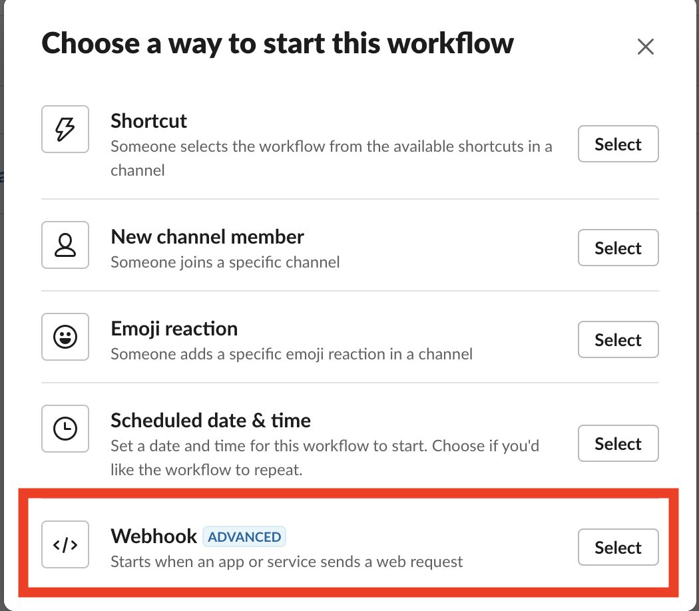
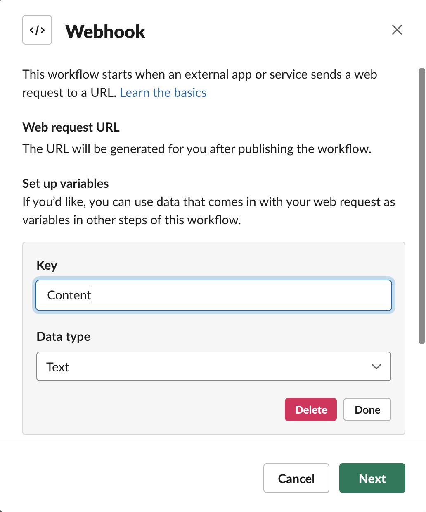
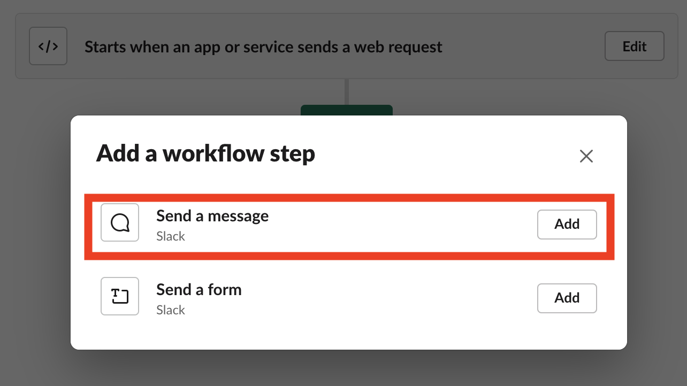
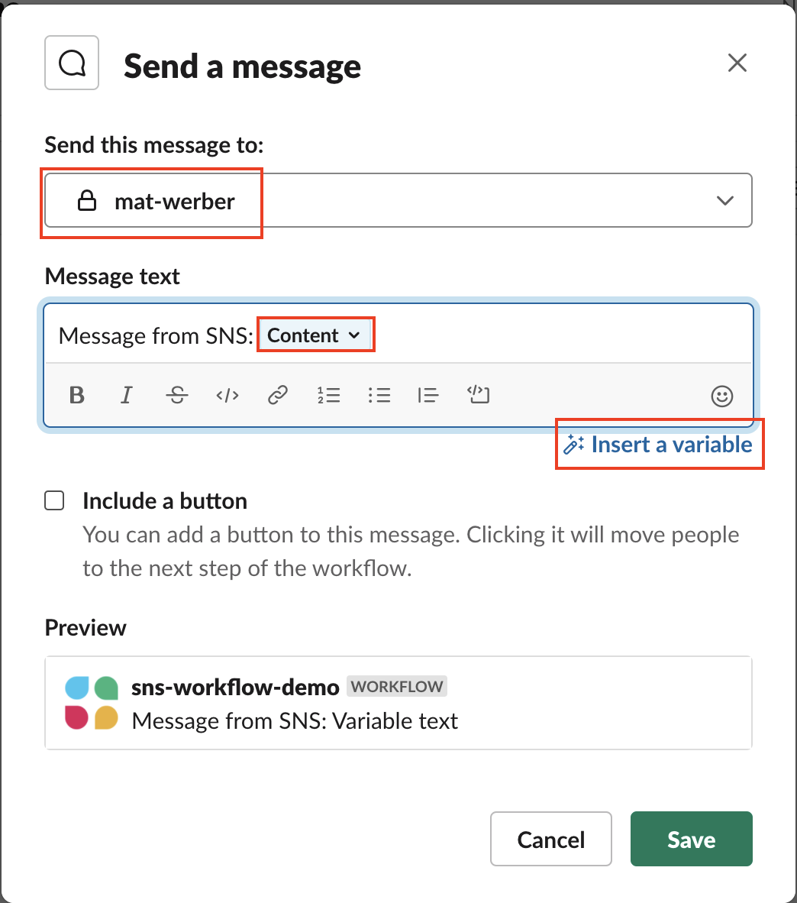
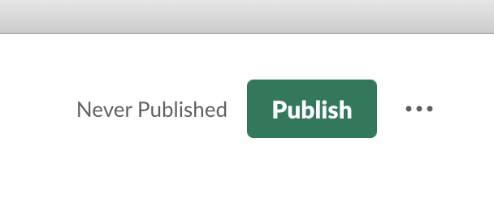
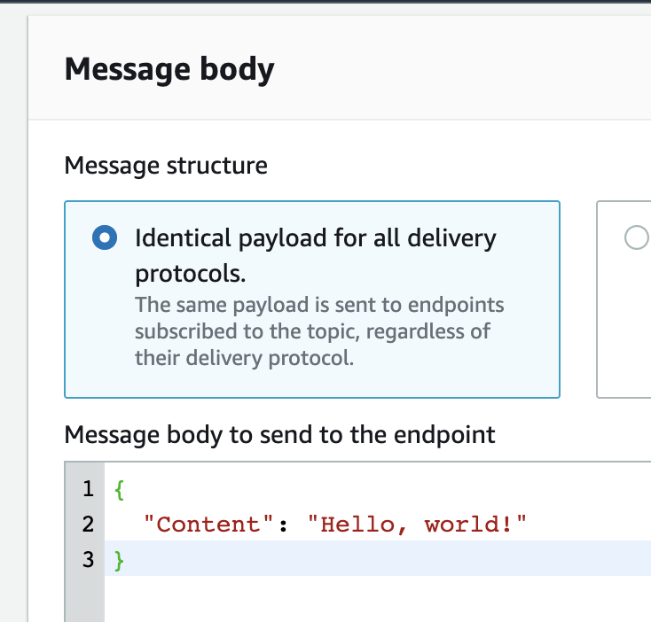

# AWS SNS Slack Integration with AWS Lambda + CDK

This is a project that provides a simple example of how you can use a Lambda function to forward SNS messages to a Slack channel. 

## Why don't you use AWS Chatbot?

[AWS Chatbot](https://docs.aws.amazon.com/chatbot/latest/adminguide/related-services.html) makes it very easy to send SNS messages to Slack. However, AWS Chatbot will only forward SNS messages to Slack **if** they were published by one of a small subset of services, such as CloudFormation or CodeDeploy. 

If you want the ability to publish SNS messages regardless of who or what published the message, you will need a solution like the one in this guide. 

## Solution Overview



This CDK project creates a an SNS topic, a Lambda subscribed to the topic, a secret in AWS Secrets Manager, and an IAM role assumed by the Lambda function. 

When a message is published to your SNS topic, it will be forwarded to your Lambda. The Lambda first retrieves the Slack webhook URL for your channel from AWS Secrets Manager and then forwards the message to Slack. 

The webhook is stored in AWS Secrets Manager because it is, by definition, a secret. Anyone with this URL could post messages to your channel. 

You can use Slack's Workflow Builder to create a webhook for your channel, which will be part of the walkthrough. 

# Deployment

## Configure Slack Webhook with Workflow Builder

1. From within your Slack channel of choice, click the lightning button in the message window in and choose Workflow Builder:

    

2. Click **Create** and give your workflow a name, such as `sns-workflow-demo` and continue to the next screen:

    

3. Choose the **Webhook** option as the way you want to start your workflow and continue to the next screen:

    

4. Click **Add variable** and create a text variable named `Content`. Then, continue to the next screen. Note - the variable name is *case-sensitive*:

    

5. Click **Add step** and click *add* for **Send a message**:

    

6. On the message configuration screen:

    1. Under **Send this message to**, enter the channel name that you want to send your message to (in my case, the channel name is `mat-werber`):

    2. In the message text, you can add any static text you want, which will always be included in every message sent. In my case, I added `Message from SNS:`. This is an optional step.

    3. Now, click the **insert variable** link and choose the `Content` variable you created earlier. 

    4. Your window should look similar to the screenshot below. If it does, click **Save**:

    

7. In the upper-right of the Workflow Builder, click **Publish**:

    

8. After a moment, you will see a dialog box stating that your workflow is ready to use. Be sure to **copy** the webhook URL, as you will need this later:

    

## Deploy AWS Resources

### Pre-requisities

1. Install and configure the [AWS Cloud Development Kit (CDK)](https://docs.aws.amazon.com/cdk/latest/guide/getting_started.html). The CDK makes it much easier to write and deploy CloudFormation templates. 

2. **Optional** - if you want to locally test your Lambda function rather than needing to deploy your CDK project after making changes to your Lambda, please also install the [AWS Serverless Application Model (SAM) CLI](https://docs.aws.amazon.com/serverless-application-model/latest/developerguide/serverless-sam-cli-install.html).

## Deploying to AWS

1. Open `bin/cdk.ts` and, if desired, change the AWS region to your preferred region and specify the name of the CloudFormation stack you would like to create. This example defaults to region `us-west-2` and a stack name of `aws-sns-slack-handler`:

    ```js
    const env = {
        region: 'us-west-2',
    };

    new CdkStack(app, 'CdkStack', {
        env: env,
        stackName: 'aws-sns-slack-handler'
    });
    ```

1. From the project's root directory, install required Javascript dependencies: 

    ```js
    npm install
    ```

1. Deploy your CDK project: 

    ```sh
    cdk deploy
    ```

## Test your project in the Cloud

1. Log in to your AWS account, navigate to the SNS console, select your SNS topic created by the CDK, and click **Publish message**:

    

2. On the message publish screen, scroll down to the **Message body** section and provide a JSON message with any value you want for the `Content` key, such as: 

    ```json
    {
      "Content": "Hello, world!"
    }
    ```

    

3. Click **Publish** to send your message. After a brief moment, you should see your message arrive in your Slack channel:

    

## Test changes to your Lambda function locally

After the initial demo is working, you may want to make changes to your Lambda function or Slack workflow. For example, you could add additional variables to the workflow. 

As long as the Lambda code is the only thing your changing, you can test changes to your Lambda function locally without needing to redploy to AWS. The only requirement is that you have completed your initial deployment, since the Secrets Manager and SNS resources need to exist. 

Once you've met these requirements and made changes to your Lambda function, you can test locally simply by running the `test-local.sh` script from the root of this project directory.

1. Transpile your Lambda's typescript to Javascript by running this command from the project root directory: 

    ```sh
    (cd lib/lambda/aws-sns-slack-handler && npm run build)
    ```

2. Synthesize the CDK project into a CloudFormation template: 

    ```sh
    cdk synth --no-staging > template.yaml
    ```

3. Open `template.yaml` and find the name of your logical Lambda function. It will be similar, but not identical, to `SimSnsSlackHandlerFunctionEF4BAE62`. 

4. To simulate a message from SNS, we use the `sample-sns-event.json` file. A demo message is already present, but you can optionally change this file as needed. 

4. Finally, run the SAM CLI command below to test your Lambda function. Replace `SimSnsSlackHandlerFunctionEF4BAE62` with the appropriate value you found in `template.yaml`:

    ```sh
    sam local invoke SimSnsSlackHandlerFunctionEF4BAE62 -l output.txt -e sample-sns-event.json
    ```

    The command above will write the function output to `output.txt`.

I've wrapped up all of the steps above into the script `test-local.sh`. The only thing you need to do before using this shortcut is to open the file and replace the function ID (e.g. `SimSnsSlackHandlerFunctionEF4BAE62`) with the value you found from `template.yaml`.